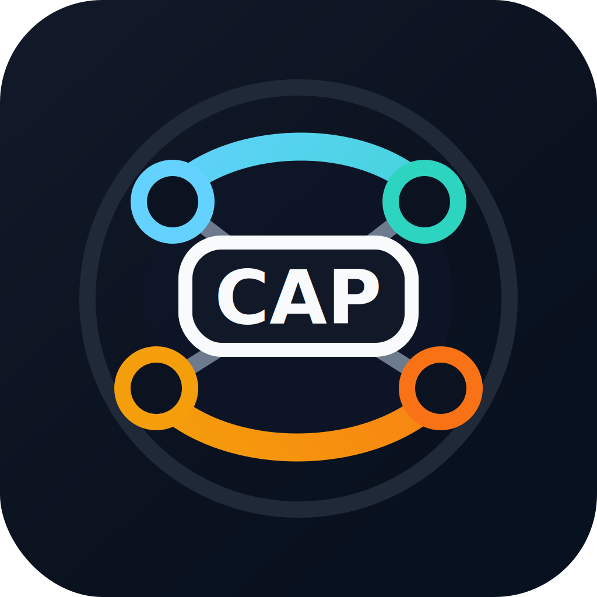

  

<h1 align="center">Cooperative Agent Protocol</h1>

  <strong>Open protocol infrastructure for cooperative industrial machine agents.</strong>

CAP defines transport-neutral communication semantics between a Site Agent and
Machine Agents operating shared industrial resources. The project focuses on
auditable coordination, typed handover, conformance testing, and reproducible
protocol-level experiments for autonomous earthwork fleets and adjacent domains.

## What CAP Provides

- A protocol specification for manifests, work orders, heartbeats, dialogue,
  entity descriptors, reservations, handover, and structured errors.
- A safety boundary that keeps deterministic safety supervision and machine
  control independent from LLM-based planning and advisory layers.
- Reference SDKs, agents, conformance tests, and public reproduction packages
  for the protocol-level results reported in the CAP paper.
- Model-checked coordination logic for shared-resource arbitration and typed
  machine-to-machine handover.

## Repositories

| Repository | Role | Start here |
| --- | --- | --- |
| [`cap-spec`](https://github.com/cooperative-agent-protocol/cap-spec) | Protocol Buffers, formal specification, ADRs, RFCs, examples, and TLA+ models. | Read the protocol overview and generated message structure. |
| [`cap-reference`](https://github.com/cooperative-agent-protocol/cap-reference) | Python SDK, reference agents, simulator adapters, and TypeScript/C++ interop surfaces. | Run the minimal Machine Agent and inspect the gRPC runtime. |
| [`cap-conformance`](https://github.com/cooperative-agent-protocol/cap-conformance) | L1/L2/L3 conformance suite covering core runtime behavior, coordination, dialogue, security, and interop. | Use the pytest suite to validate an implementation. |
| [`cap-coordination-kit`](https://github.com/cooperative-agent-protocol/cap-coordination-kit) | Public protocol-logic kit for reservation arbitration, typed handover, operational-P4 models, and refinement monitoring. | Reproduce the open coordination invariants. |
| [`cap-bench`](https://github.com/cooperative-agent-protocol/cap-bench) | Offline reproduction package for fault-injection and fleet-size benchmark campaigns. | Run smoke campaigns or full paper-scale sweeps. |

## Design Stance

CAP is designed to be machine-agnostic, transport-neutral, and safety-independent.
It is meant to standardize the coordination layer without claiming ownership of
low-level control, perception, emergency stop, or OEM-specific safety systems.

The current public repos are released under Apache-2.0 and are organized around
independent implementation, conformance, and reproduction.
